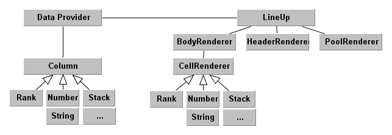

LineUp.js: Visual Analysis of Multi-Attribute Rankings
======================================================

LineUp is an interactive technique designed to create, visualize and explore rankings of items based on a set of heterogeneous attributes. 
This is a D3-based re-implementation with limited functionality relative to the original stand-alone LineUp, which you can check out at http://lineup.caleydo.org

Dependencies
------------

LineUp.js depends on [D3](http://d3js.org) for rendering and [FontAwesome](http://fontawesome.io/) for icons in the toolbar. Both dependencies are declared as bower dependencies. 

Dev Dependencies
----------------

[Grunt](http://gruntjs.com/) is used a the building tool. LineUp itself is written in [TypeScript](www.typescriptlang.org) and [SASS](http://sass-lang.com). 
[Browserify](http://browserify.org/) is used for building with a modified [UMD](https://github.com/umdjs/umd) header that is prepended avoiding to include the external dependencies 

DOM Structure
-------------

The DOM elements are composed of three parts: header, body, and pool. 
The header and pool are using HTML5 and the body SVG. However, the body could be rewritten to using HTML, too. 
The body is using a mix of row and column based approach. Rows are used for the background alteration and for hovering over rows. 
Column groups are used for efficient use of D3 for rendering individual columns. Individual columns require different rendering strategies. 

Data Model
----------

Documentation
-------------

[TypeDoc Docu](http://caleydo.github.io/lineup.js/docs/index.html)

